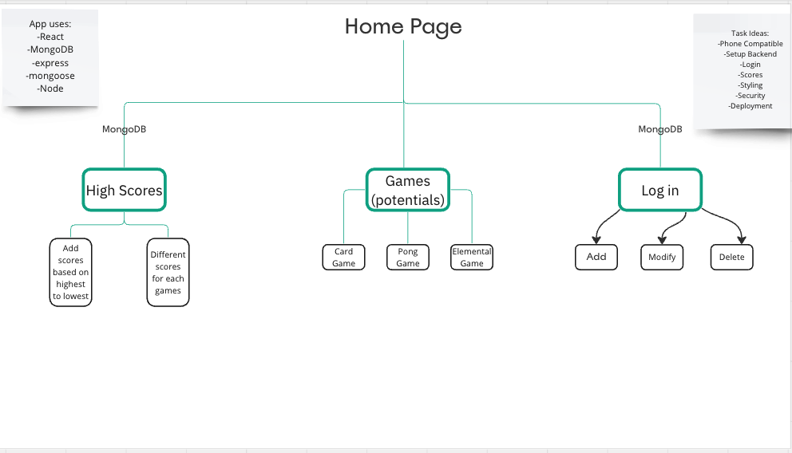

# GameHub-App

## Table of Contents
- [Project Overview](#project-overview)
- [Technologies Used](#technologies-used)
- [Features](#features)
- [Installation](#installation)
- [Usage](#usage)
- [Known Issues](#known-issues)
- [Contributors](#contributors)
- [Credits](#credits)
- [License](#license)

## Project Overview


This project is a web-based game app that includes several classic games, such as a card game, ping pong, and elemental attack game. It also features user authentication for secure logins and a high scores section to track the top players. The application aims to provide an enjoyable gaming experience and a platform for users to compete and showcase their skills.  The image shows our initial design structure, and the planning of our game app.

## Technologies Used

- **Front-end:**
  - React.js
  - HTML/CSS
  - JavaScript

- **Back-end:**
  - Node.js
  - Express.js
  - MongoDB
  - Mongoose
  
- **Authentication:**
  - User authentication is password encrypted

## Features

1. User Authentication:
   - User registration and login.

2. Game Selection:
   - Multiple classic games available for users to play.

3. High Scores:
   - Keep track of the highest scores achieved by users in each game.
   - Leaderboard to display the top players.

## Installation

To run the application locally, follow these steps:

1. Clone the repository from GitHub:

   ```bash
   git clone https://github.com/Kal0yanX/GameHub-App.git
   ```

2. Navigate to the project directory:

   ```bash
   cd game-app
   ```

3. Install dependencies for both the back-end and front-end:

   ```bash
   cd backend
   npm install
   cd ../frontend
   npm install
   ```

4. Set up your MongoDB database and configure the connection in the back-end.

5. Start the back-end server:

   ```bash
   cd ../backend
   npm start
   ```

6. Start the front-end development server:

   ```bash
   cd ../frontend
   npm start
   ```

7. Open your web browser and access the application at `http://localhost:3000`.

## Usage

1. Register for an account or log in if you already have one.
2. Choose a game from the available options (card game, ping pong, elemental attack game).
3. Play the selected game and try to achieve the highest score.
4. Check the high scores section to see where you rank among other players.

## Known Issues

- Deployment was having issues connecting backend, however frontend and backend were able to deploy, data was not integrated: 
-frontend: https://game-hub-app-lake.vercel.app/
-backend: https://game-hub-app-monorepo.vercel.app/

## Contributors

- Juan Mireles
- Matthew Wolfe
- Thomas Guerrero
- William Brewster

## Credits

This project was developed with the assistance of the following tutorial:

- [MERN Crash Course | JWT Authentication, Redux Toolkit, Deployment & More](<URL>)
  - **Author:** [Brad Traversy]
  - **YouTube Channel:** [https://www.youtube.com/@TraversyMedia]
  - **Link to Video:** [https://www.youtube.com/@TraversyMedia]


## License

This project is licensed under the [MIT License](LICENSE).